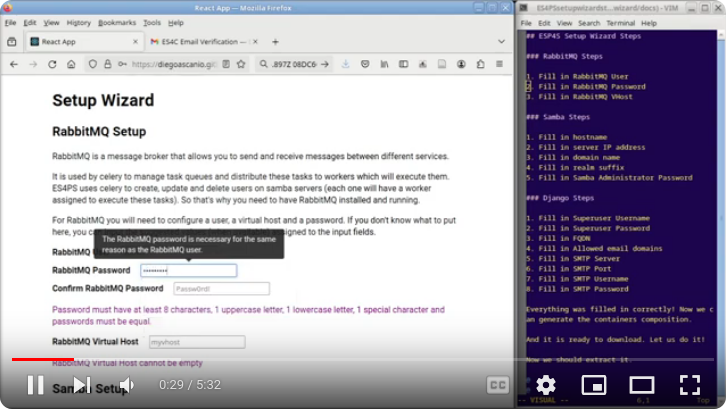
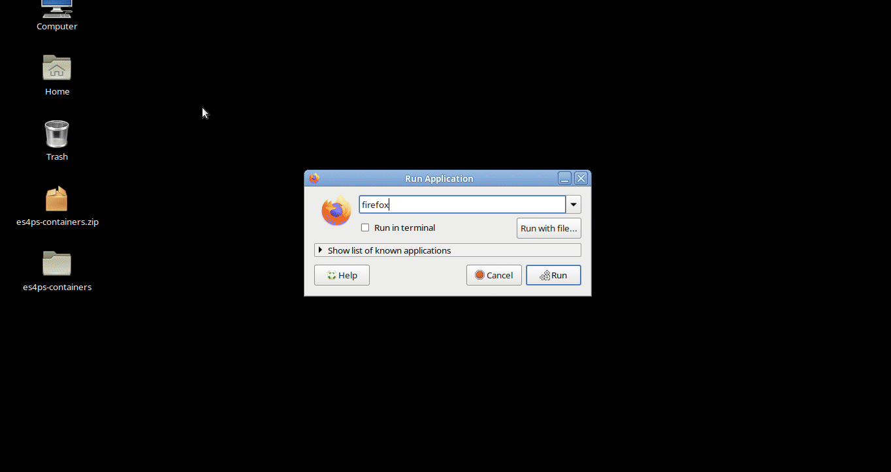
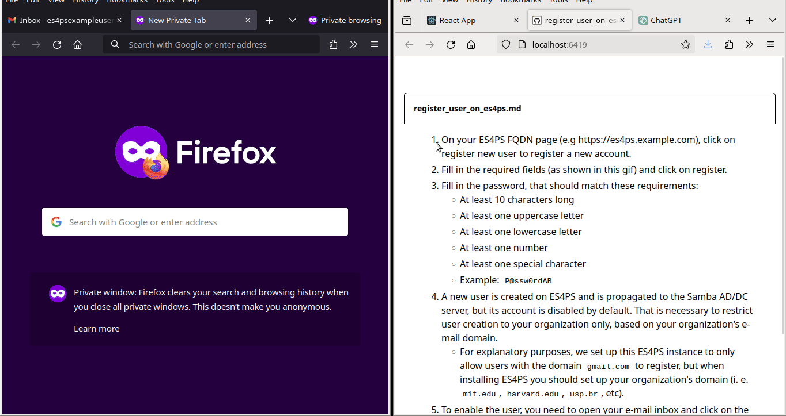

# ES4PS Setup Wizard

This is a wizard to set the Easy Samba for Public Services (ES4PS)
containers composition up. This wizard will guide you through the process
of setting up the necessary parameters for the ES4PS containers to work properly
and get a zip file with the configured composition to run the ES4PS platform.

## Prerequisites to run the setup wizard

- A SMTP STARTTLS capable e-mail account with its user and password to send e-mails.
    - We recommend using Microsoft e-mail accounts (like @outlook.com,
      @live.com, @hotmail.com) as they support SMTP starttls encryption
      and don't require additional settings to run as Gmail accounts do.
        - To register a new account, go to [outlook.com](https://outlook.live.com/owa/)
          and click on the "Create account" button.
    - If you want to use a Gmail account, you should allow less secure apps
      to access your account and disable the two-factor authentication. This README will not show how to do that, but you can find this information on your favorite search engine.

## How to run the setup wizard

To run the setup wizard, you should access the following link:

[ES4PS Setup Wizard](https://diegoascanio.github.io/es4ps-setup-wizard/)

Then, you should fill in the required fields. Some fields present a tooltip
that will help you to understand its purpose and how to fill its value.

After filling in all required fields, a generate containers composition button
will be enabled. Click on it to create the zip file with the configured
composition.

After the zip file is ready, a link to download the file will appear.
Proceed to download it and extract the zip file to get the necessary files
to run the ES4PS.

All of these procedures are available in the video below:

[](https://youtu.be/-ymDxufMSNc?si=GFGq1qqZ9Mj8khlb)

## How to run the ES4PS platform

### Requirements

To run the ES4PS platform, you should have docker and docker-compose installed. Follow the [docker instructions](https://docs.docker.com/engine/install/) appropriate to your distro to install the docker engine and [these instructions](https://docs.docker.com/compose/install/linux/) to install docker-compose.

If you are using a Windows or Mac OS system, it is strongly recommended that you use the [docker desktop](https://docs.docker.com/desktop/) to install both the docker engine and docker-compose, as well as GUI tools that can help you manage the composition of containers for ES4PS or any other containers that you might want to run.

### Running the ES4PS platform in a Linux distro

Go to the folder where you extracted the zip file generated by the setup wizard and run the following commands:

```bash
bash build.sh # This will build the containers # This will build the containers and should be run only once
bash start.sh # This will start the containers
```

After running these commands, the ES4PS platform should be up and running. You can access the platform by browsing the address defined as **ES4PS Fully Qualified Domain Name (FQDN)** in the setup wizard's Django setup section. Add an exception in your browser to access the platform, as the certificates are self-signed and not recognized by the browser:



### Registering a new user in the ES4PS platform

Any user within your organization should access the platform website to create their accounts and execute the following steps:

1. Click the `register new user` button to create a new account on the ES4PS FQDN page (e.g., https://es4ps.example.com).
2. Fill the required fields and click on register.
    1. The password, that should match the following requirements:
        - At least ten characters long
        - At least one uppercase letter
        - At least one lowercase letter
        - At least one number
        - At least one special character
        - Example: `P@ssw0rdAB`
    - After the user fills out the mandatory fields, a new account is created on ES4PS and propagated to the Samba AD/DC server, but this new account is disabled by default to restrict user creation to your organization only based on your organization's e-mail domain and verify the user's tie to the organization.
3. To enable their account, the user needs to open their e-mail inbox, click on the activation link sent by the ES4PS platform, or input the activation code manually.
    - When a user is verified (activated), a Celery task on ES4PS is triggered to enable its account on the Samba AD/DC server. After this step, any verified user will be able to log in on any computer within the domain.

Now you'll see the user POV when creating its account in the ES4PS platform (and verifying it) to be able to login in Windows clients in your organization's network:



### Adding a computer to the ES4PS Domain

To add a Windows machine to the ES4PS Domain, you should follow the steps below:

1. Ensure that the Windows machine is connected to the ES4PS network.
2. Ensure that the Windows machine DNS is provided by the ES4PS DNS server.
    - You can do this by setting the DNS server in the network adapter settings.
    - This IP address is the **Samba Server IP Address** you filled in the setup wizard.
3. Ensure that IPv6 network support is disabled.
    - This is necessary because the ES4PS current release does not support IPv6, but future releases will.
    - You can do this by unchecking the IPv6 checkbox in the network adapter settings.
4. Now, open the Windows Explorer, right-click on "This PC" and select "Properties".
5. Click on "Change settings" in the "Computer name, domain, and workgroup settings" section.
6. Click on "Change" in the "Computer Name/Domain Changes" window.
7. Select "Domain" and enter the domain name, which combines the **Samba Server Domain Name** and **Samba Realm Suffix** fields you filled out in the setup wizard.
    - For example, if the **Samba Server Domain Name** is `dom` and the **Samba Realm Suffix** is `es4ps.local`, then the domain name would be `dom.es4ps.local`.
8. Click "OK" and enter **Administrator** as Username and **Samba Server Administrator Password** that you filled in the setup wizard as the Password.
9. Joining the domain will take a few seconds to a few minutes. So, grab a cup of coffee and wait.
    - Some tools, like FOG (Free Open-source Ghost), can automate this process so you can join the domain without any manual intervention. This automation is extremely useful in scenarios like computer labs, and a future ES4PS release will cover the integration between FOG and ES4PS.
10. After a few minutes, you'll be greeted with a welcome message into the domain, and then, after a few seconds, you'll be asked to restart the computer. Proceed with that.

### Performing a user login in a computer at the ES4PS Domain

1. After restarting the computer (and completing the domain join process), you should see the user login screen.
    - Any user self-registered within the ES4PS platform can log in to the computer now.
2. A self-registered user can log in by clicking on "Other user" and typing the username and password.
    - For instance, the `es4psexampleuser` created in the **Registering a new user in the ES4PS platform** section can log in by typing `es4psexampleuser` in the username field and the password created in the registration process.
        - If you followed the password example in the registration process, the password should be `P@ssw0rdAB`.
3. After typing the username and password, click on the arrow or press Enter to log in.
4. After a few seconds (or SEVERAL minutes) the user will be greeted with a welcome message and the desktop will be shown.
    - With that step completed you can congratulate yourself for setting up the ES4PS platform that will help your organization to manage its users (and computers in future releases) in a clever way!

## ES4PS-setup-wizard Useful Information

This project is a pure react application that uses the `create-react-app`
boilerplate to create a setup wizard for the ES4PS project. 

React was chosen as the main technology for this wizard because this wizard will be only
a single-page application with no need for routing, server-side rendering
or any other kind of feature that would require a specialized framework
for doing so.

All components are defined in the `es4ps-setup-wizard/src/components` folder. 
As the author could not load external functions in the components that are not
in the same folder, there are also some javascript functions that are not 
components but are needed by the components, and they exist in the 
`components` folder as well.

These are:

- `./components/genDotEnvFile.js`
- `./components/validators.js`

All the components and functions are properly commented to help anyone 
who wants to contribute to the project and/or this setup wizard tool.

Another thing to note is that the `utils` folder contains functions — that are 
not currently used in this release — to generate self-signed certificates.
These functions would be used if the **select mode for choosing to upload or
generate self-signed certificates** component was implemented.
These codes didn't work as expected, and it was decided — to ensure the first
MVP — to impose self-signed certificate generation in the containers that
would need certificates to encrypt its communications.
Anyways, the `utils` codes are there as a reference for future implementations.

